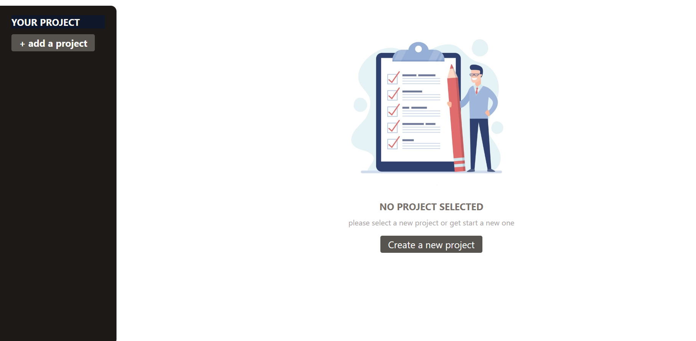

## 📁 React Project & Task Manager
### 📖 Summary
This is a simple and responsive Project & Task Management App built using React. The app allows users to create multiple projects, add tasks to each project, and manage their workflow effectively. It's designed with reusability and modularity in mind, making it a great foundation for more complex productivity applications

### 🔗[Live Demo](https://task-management-pearl-iota.vercel.app/)

### 🚀 Features
* 🆕 Create new projects with title, description, and due date
* 📋 Add and manage tasks per project
* ✅ Dynamic task filtering per selected project
* ❌ Delete individual tasks or entire projects
* 🖼️ Default placeholder screen when no project is selected
* 🎯 Modal dialog support (via createPortal)
* 🎨 Tailwind CSS for clean and responsive styling

### 🧠 How It Works
* The app manages its state using useState with a nested object containing projects, tasks, and selectedProjectId
* A sidebar lists all projects. Clicking one selects it and shows details
* A new project form appears when the user clicks “Add a project”
* Tasks are tied to their parent projects using projectId
* Tasks and projects can be deleted with dedicated buttons
* Task input validation gives feedback for overly long entries
* Modal dialogs are implemented using React’s forwardRef, useImperativeHandle, and createPortal

### 📂 Project Structure
![Project Structure (image/structure.png)

### 🖼️ Screenshots

### 🛠️ Technologies Used
* ⚛️ React (Functional Components & Hooks)
* 🎨 Tailwind CSS
* 🧱 HTML5, CSS3, JavaScript (ES6+)
* 🌀 React Portals for modal handling

### 👨‍💻 Author
###### Mohammad Baghban Rezaee
###### GitHub:https://github.com/mohammadr1997
